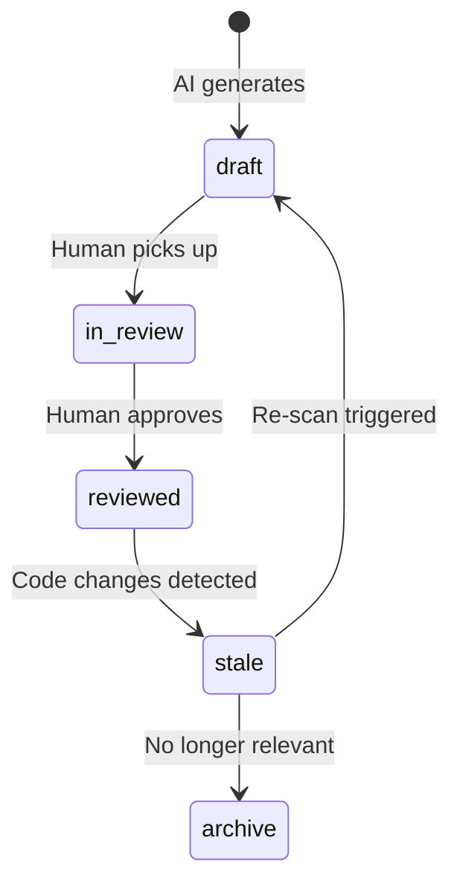

# Vault Overview

## Purpose

This vault stores **technical documentation** for the Ashylist platform, serving maintenance, analysis, onboarding, impact assessment, and architecture review.

**Stack**: Markdown + Obsidian + Git | **Framework**: arc42 | **Maintenance**: AI-assisted with human review

## Folder Structure

```
SystemDocsVault/
├── 00-Start-Here/          ← Vault structure, rules, templates
│   └── templates/          ← Arc42 + module/flow/API/entity/ADR templates
├── 01-Systems/             ← Arc42 main docs, one set per system
├── 02-Modules/             ← Module responsibility & logic
├── 03-Flows/               ← Business flows & runtime scenarios
├── 04-Interfaces/          ← API specs & external integrations
├── 05-Data/                ← Entity, table, schema mapping
├── 06-Decisions/           ← Architecture Decision Records (ADR)
├── 07-Operations/          ← Jobs, config, incidents, runbooks, governance
├── 08-Open-Questions/      ← Unconfirmed logic, unknown behaviour
└── 99-Archive/             ← Retired documents
```

## Folder Rules

| Folder | Content | Example |
|--------|---------|---------|
| `00-Start-Here/` | Vault guides, style rules, templates only | `01 Documentation Style Guide.md` |
| `01-Systems/` | Arc42 chapter docs per system | `01 Introduction and Goals - Ashylist.md` |
| `02-Modules/` | One note per module | `Module - Auth.md` |
| `03-Flows/` | One note per business flow | `Flow - Booking Payment.md` |
| `04-Interfaces/` | API and integration docs | `API - User Management.md` |
| `05-Data/` | Entity and schema docs | `Entity - User.md` |
| `06-Decisions/` | ADRs, numbered sequentially | `ADR - 001 Use MongoDB.md` |
| `07-Operations/` | Ops, governance, runbooks | `01 Solution Overview.md` |
| `08-Open-Questions/` | Unknown logic, needs confirmation | `01 Unknown Logic Register.md` |
| `99-Archive/` | Superseded or deprecated docs | Move here, never delete |

## Naming Rules

| Type | Pattern | Example |
|------|---------|---------|
| System arc42 | `<NN> <Chapter> - <System>.md` | `03 Context and Scope - Ashylist.md` |
| Module | `Module - <Name>.md` | `Module - Auth.md` |
| Flow | `Flow - <Name>.md` | `Flow - Booking Payment.md` |
| API | `API - <Name>.md` | `API - User Management.md` |
| Entity | `Entity - <Name>.md` | `Entity - User.md` |
| ADR | `ADR - <NNN> <Title>.md` | `ADR - 001 Use MongoDB.md` |
| Troubleshooting | `Troubleshooting - <Topic>.md` | `Troubleshooting - Token Expiry.md` |

## Frontmatter Schema

Every note must include:

```yaml
---
title: <string>
type: <system | module | flow | api | entity | adr | operations | troubleshooting | vault-guide>
system: <system name, e.g. ashylist-backend>
status: <draft | in-review | reviewed | stale>
created: <YYYY-MM-DD>
updated: <YYYY-MM-DD>
tags: []
---
```

## Status Lifecycle



| Status | Meaning |
|--------|---------|
| `draft` | AI-generated, not yet human-verified |
| `in-review` | Human is reviewing |
| `reviewed` | Human has confirmed accuracy |
| `stale` | Suspected outdated, needs re-check |

## Tags

- **System**: `ashylist-backend`, `ashylist-flutter`
- **Module**: `auth`, `payments`, `classes`, `schedules`, `tokens`, etc.
- **Type**: `arc42`, `module`, `flow`, `api`, `entity`, `adr`
- **Concern**: `security`, `performance`, `data-model`, `integration`
- **Status**: `draft`, `needs-confirmation`

See [[02 Tagging Rules]] for complete guidelines.

## Internal Links

- Use `[[wiki-links]]` for all cross-references
- Every note must have a `## Related Notes` section at the bottom
- Link to the parent system index from every system-specific note
- Link to related modules, flows, and entities where applicable

See [[01 Documentation Style Guide]] and [[03 Frontmatter Rules]] for details.

## Writing Rules

1. Every note **must** have frontmatter
2. Every note **must** list related notes
3. Uncertain content **must** be marked: `> [!WARNING] Assumption` or `> [!CAUTION] Needs confirmation`
4. Flows **should** include Mermaid diagrams
5. Do **not** restate code — explain responsibility, rules, edge cases, risks

## Related Notes

- [[01 Documentation Style Guide]]
- [[02 Tagging Rules]]
- [[03 Frontmatter Rules]]
- [[04 Review Workflow]]
- [[01 Solution Overview]]
