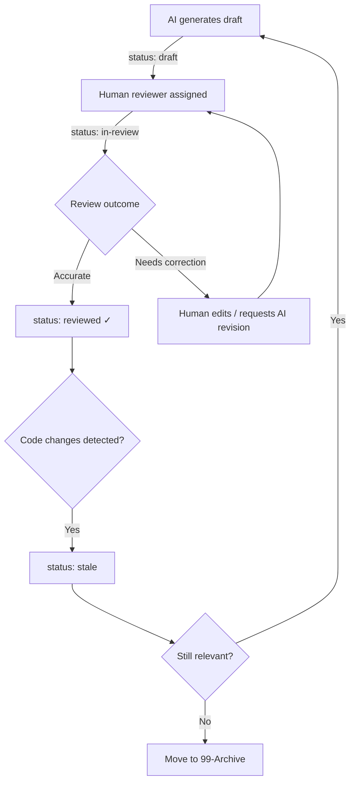

# Review Workflow

## Overview

All documentation follows a **draft → review → approved** lifecycle. AI generates drafts; humans verify accuracy.

## Workflow

## Review Checklist

When reviewing an AI-generated draft, check:

- [ ] **Facts are correct** — verify against source code
- [ ] **Assumptions are labelled** — all `> [!WARNING] Assumption` callouts are appropriate
- [ ] **Open questions are flagged** — nothing left unmarked as uncertain
- [ ] **Mermaid diagrams are accurate** — flows match actual code behaviour
- [ ] **Related notes are linked** — no orphan notes
- [ ] **Frontmatter is complete** — all required fields present
- [ ] **Tags follow rules** — see [[02 Tagging Rules]]
- [ ] **No code duplication** — explains logic, not copies code

## Priority Order

Review these document types first (highest impact):

1. **Flows** — business-critical sequences (payment, booking, auth)
2. **Modules** — core module responsibilities
3. **APIs** — external-facing contracts
4. **Entities** — data model accuracy
5. **ADRs** — decision records
6. **System chapters** — arc42 overview docs

## Stale Detection

A note should be flagged `stale` when:
- The source code it describes has been modified since `updated` date
- A related module has been refactored
- A referenced API endpoint has changed
- A team member recognises outdated information

## Related Notes

- [[00 Vault Overview]]
- [[01 Documentation Style Guide]]
- [[01 Solution Overview]]
