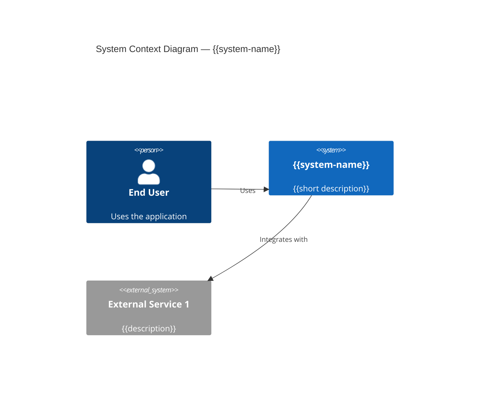

# System Index — {{system-name}}

## Overview

> One-paragraph summary: what this system does, who uses it, and why it exists.

{{Describe the system's purpose, target users, and business context.}}

## System at a Glance

| Attribute | Value |
|-----------|-------|
| **Repository** | {{repo URL or path}} |
| **Tech stack** | {{e.g. Node.js / Express / MongoDB}} |
| **Deployment** | {{e.g. Docker / AWS / GCP}} |
| **Primary users** | {{e.g. end users, admin staff, API consumers}} |
| **Status** | {{e.g. production, beta}} |

## Architecture Overview

## Arc42 Chapters

| # | Chapter | Link |
|---|---------|------|
| 1 | Introduction and Goals | [[01 Introduction and Goals - {{system-name}}]] |
| 2 | Constraints | [[02 Constraints - {{system-name}}]] |
| 3 | Context and Scope | [[03 Context and Scope - {{system-name}}]] |
| 4 | Solution Strategy | [[04 Solution Strategy - {{system-name}}]] |
| 5 | Building Block View | [[05 Building Block View - {{system-name}}]] |
| 6 | Runtime View | [[06 Runtime View - {{system-name}}]] |
| 7 | Deployment View | [[07 Deployment View - {{system-name}}]] |
| 8 | Crosscutting Concepts | [[08 Crosscutting Concepts - {{system-name}}]] |
| 9 | Architectural Decisions | [[09 Architectural Decisions - {{system-name}}]] |
| 10 | Quality Requirements | [[10 Quality Requirements - {{system-name}}]] |
| 11 | Risks and Technical Debt | [[11 Risks and Technical Debt - {{system-name}}]] |
| 12 | Glossary | [[12 Glossary - {{system-name}}]] |

## Key Modules

| Module | Responsibility | Link |
|--------|---------------|------|
| {{module-name}} | {{one-line description}} | [[Module - {{module-name}}]] |

## Key Flows

| Flow | Description | Link |
|------|-------------|------|
| {{flow-name}} | {{one-line description}} | [[Flow - {{flow-name}}]] |

## Facts

> [!NOTE] Fact
> {{List verified facts about this system.}}

## Assumptions

> [!WARNING] Assumption
> {{List inferred information not yet confirmed.}}

## Open Questions

> [!CAUTION] Open Question
> {{List unresolved questions about this system.}}

## Related Notes

- [[00 Vault Overview]]
- {{Add links to related modules, flows, APIs, entities}}
