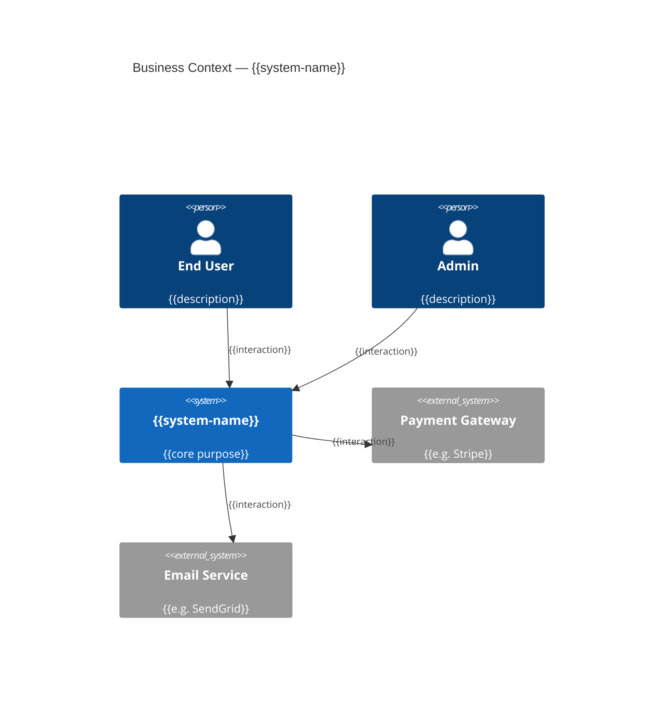
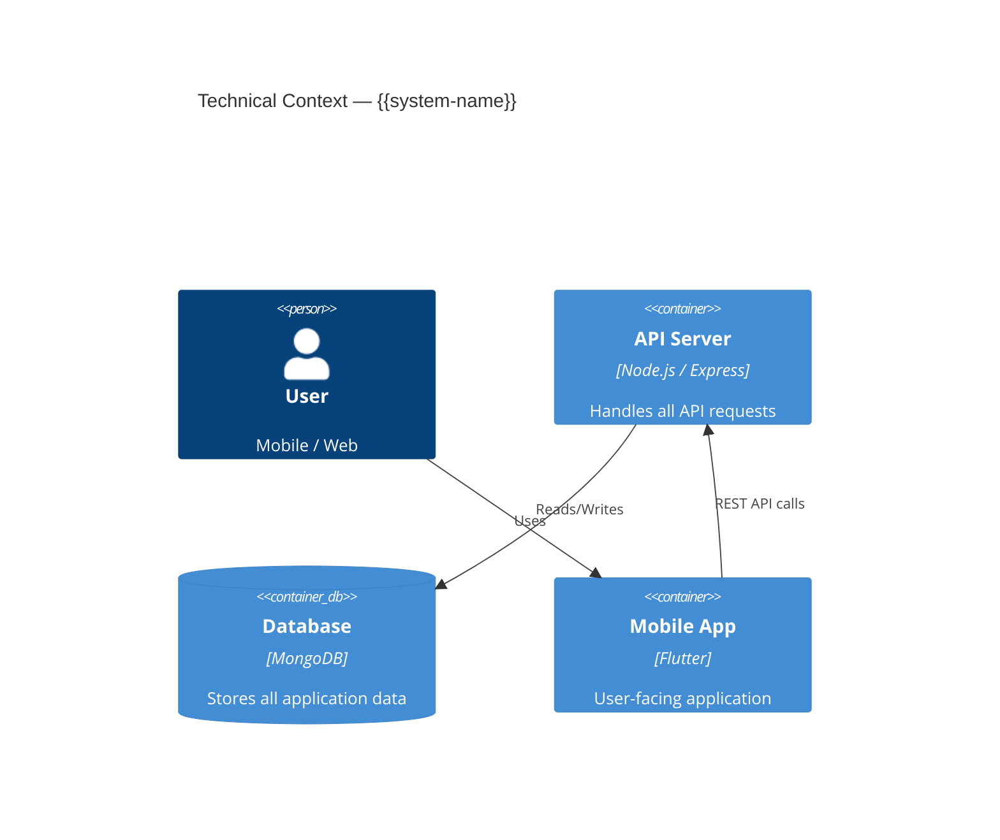

# 03 Context and Scope — {{system-name}}

## Business Context

> Who interacts with this system and for what purpose?

| Partner | Description | Interface |
|---------|-------------|-----------|
| {{partner}} | {{what it does}} | {{REST API / webhook / SDK}} |

## Technical Context

> How does the system connect technically to its environment?

| Channel | From | To | Protocol | Notes |
|---------|------|------|----------|-------|
| {{channel}} | {{source}} | {{target}} | {{e.g. HTTPS REST}} | {{notes}} |

## Facts

> [!NOTE] Fact
> {{Verified integrations and context boundaries.}}

## Assumptions

> [!WARNING] Assumption
> {{Inferred external dependencies.}}

## Open Questions

> [!CAUTION] Open Question
> {{Unclear integration points or boundaries.}}

## Related Notes

- [[02 Constraints - {{system-name}}]]
- [[04 Solution Strategy - {{system-name}}]]
- [[05 Building Block View - {{system-name}}]]
