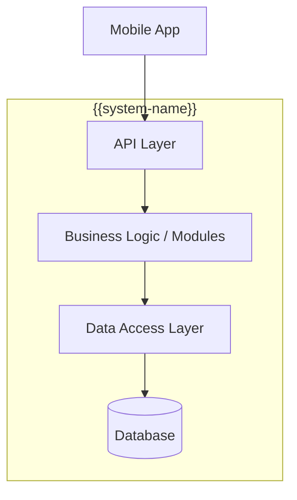

# 04 Solution Strategy — {{system-name}}

## Technology Decisions

| Area | Decision | Rationale |
|------|----------|-----------|
| Runtime | {{e.g. Node.js}} | {{why}} |
| Framework | {{e.g. Express}} | {{why}} |
| Database | {{e.g. MongoDB}} | {{why}} |
| Frontend | {{e.g. Flutter}} | {{why}} |
| Auth | {{e.g. JWT}} | {{why}} |

## Top-Level Decomposition

> How is the system broken down at the highest level?

## Key Design Decisions

| Quality Goal | Approach | Related ADR |
|-------------|----------|-------------|
| {{e.g. Security}} | {{e.g. JWT + middleware guards}} | [[ADR - {{nnn}} {{title}}]] |
| {{e.g. Scalability}} | {{approach}} | {{ADR link or N/A}} |

## Facts

> [!NOTE] Fact
> {{Verified strategy decisions from code/config.}}

## Assumptions

> [!WARNING] Assumption
> {{Inferred design rationale.}}

## Open Questions

> [!CAUTION] Open Question
> {{Unclear strategic decisions.}}

## Related Notes

- [[03 Context and Scope - {{system-name}}]]
- [[05 Building Block View - {{system-name}}]]
- [[09 Architectural Decisions - {{system-name}}]]
