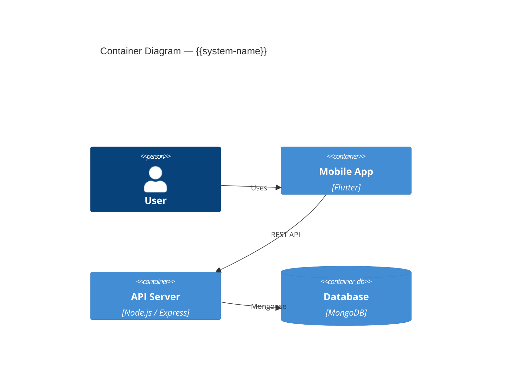
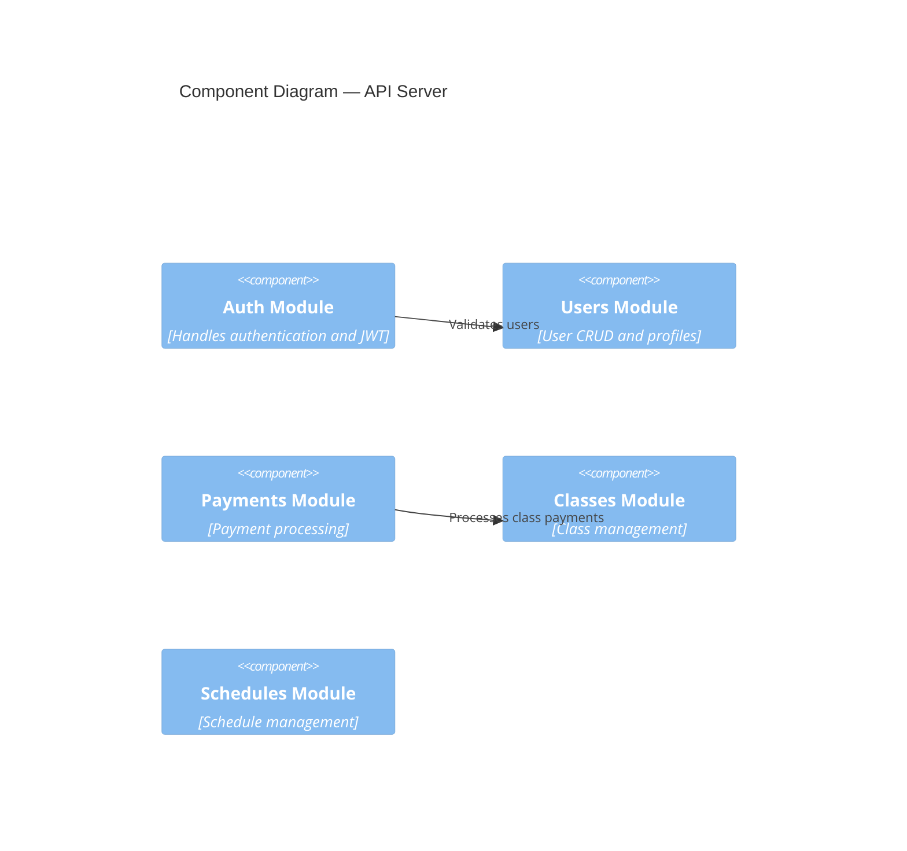

# 05 Building Block View — {{system-name}}

## Level 1: Overall System

## Level 2: Module Breakdown

> Replace placeholder modules with actual modules from the system.

## Module Registry

| Module | Responsibility | Key Files | Link |
|--------|---------------|-----------|------|
| {{module}} | {{one-line}} | {{e.g. `src/modules/auth/`}} | [[Module - {{module}}]] |

## Facts

> [!NOTE] Fact
> {{Verified module structure from code.}}

## Assumptions

> [!WARNING] Assumption
> {{Inferred module boundaries or responsibilities.}}

## Open Questions

> [!CAUTION] Open Question
> {{Unclear module boundaries or ownership.}}

## Related Notes

- [[04 Solution Strategy - {{system-name}}]]
- [[06 Runtime View - {{system-name}}]]
- {{Link to each [[Module - X]] note}}
