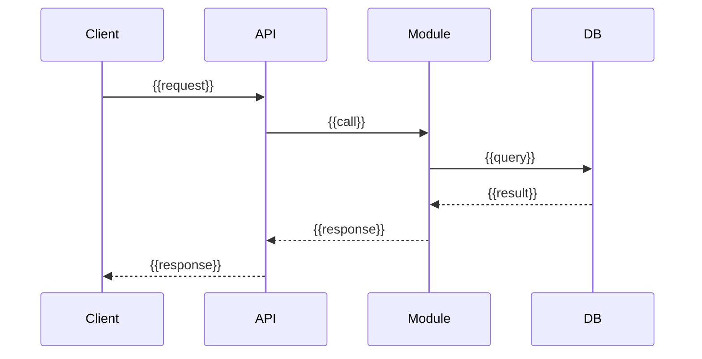
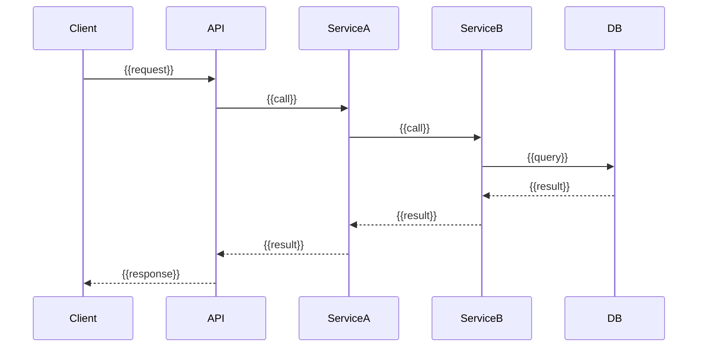

# 06 Runtime View — {{system-name}}

## Key Runtime Scenarios

### Scenario 1: {{scenario-name}}

> {{Brief description of what this scenario demonstrates.}}

**Trigger**: {{what initiates this flow}}
**Happy path**: {{expected outcome}}
**Error cases**: {{what can go wrong}}

### Scenario 2: {{scenario-name}}

## Scenario Index

| # | Scenario | Modules Involved | Link |
|---|----------|-----------------|------|
| 1 | {{name}} | {{modules}} | [[Flow - {{name}}]] |
| 2 | {{name}} | {{modules}} | [[Flow - {{name}}]] |

## Facts

> [!NOTE] Fact
> {{Verified runtime behaviour from code.}}

## Assumptions

> [!WARNING] Assumption
> {{Inferred runtime behaviour.}}

## Open Questions

> [!CAUTION] Open Question
> {{Unclear runtime behaviour or edge cases.}}

## Related Notes

- [[05 Building Block View - {{system-name}}]]
- [[07 Deployment View - {{system-name}}]]
- {{Link to [[Flow - X]] notes}}
