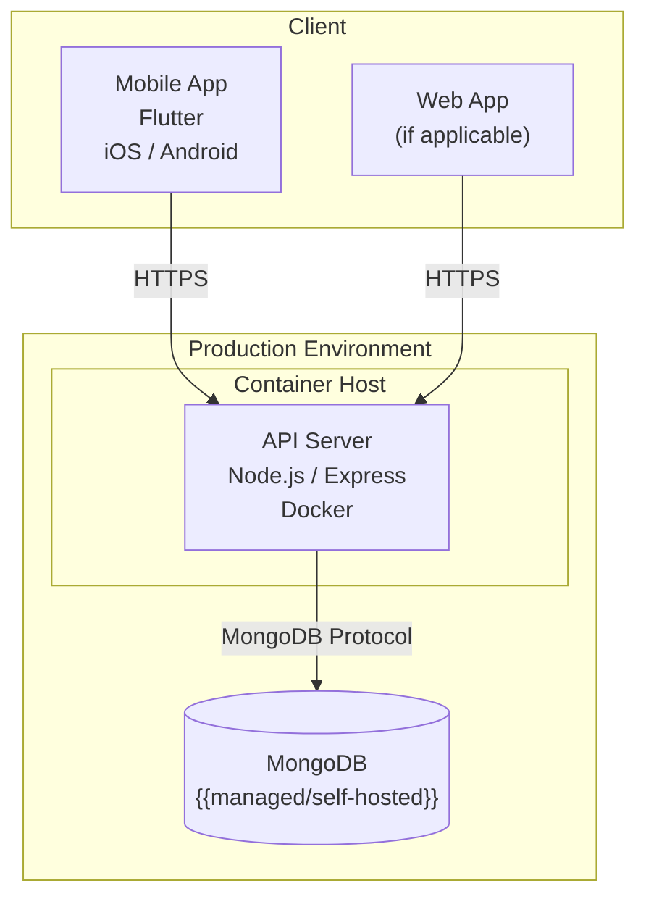
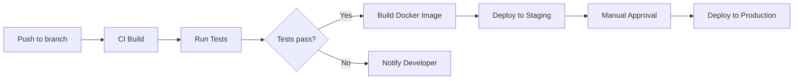

# 07 Deployment View — {{system-name}}

## Infrastructure Overview

## Environment Configuration

| Environment | Purpose | Config File | Notes |
|-------------|---------|-------------|-------|
| `dev` | Local development | {{e.g. `.env.dev`}} | {{notes}} |
| `stage` | Staging / QA | {{e.g. `.env.stage`}} | {{notes}} |
| `prod` | Production | {{e.g. `.env.prod`}} | {{notes}} |

## Docker / Container Setup

| Service | Image | Ports | Volumes |
|---------|-------|-------|---------|
| API | {{image name}} | {{e.g. 3000:3000}} | {{volumes}} |
| DB | {{image name}} | {{e.g. 27017:27017}} | {{volumes}} |

## CI/CD Pipeline

## Facts

> [!NOTE] Fact
> {{Verified deployment config from Dockerfile, compose files, CI config.}}

## Assumptions

> [!WARNING] Assumption
> {{Inferred deployment details.}}

## Open Questions

> [!CAUTION] Open Question
> {{Unclear deployment or infrastructure details.}}

## Related Notes

- [[06 Runtime View - {{system-name}}]]
- [[08 Crosscutting Concepts - {{system-name}}]]
