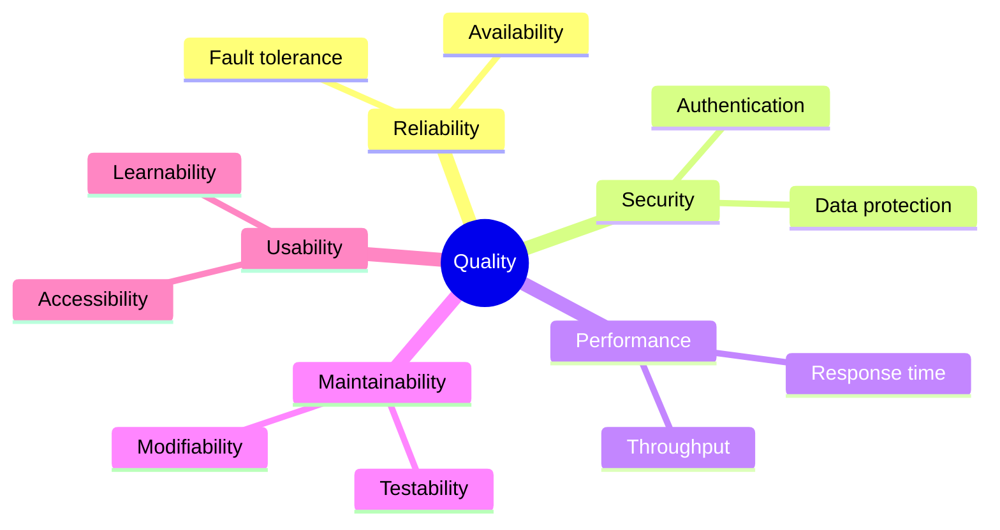

# 10 Quality Requirements — {{system-name}}

## Quality Tree

## Quality Scenarios

| ID | Quality | Scenario | Expected Response | Priority |
|----|---------|----------|-------------------|----------|
| QS1 | {{e.g. Reliability}} | {{stimulus and context}} | {{expected behaviour}} | {{high/medium/low}} |
| QS2 | {{e.g. Security}} | {{stimulus}} | {{expected behaviour}} | {{priority}} |
| QS3 | {{e.g. Performance}} | {{stimulus}} | {{expected behaviour}} | {{priority}} |

## Test Coverage

| Area | Coverage | Tool | Notes |
|------|----------|------|-------|
| Unit tests | {{e.g. 60%}} | {{e.g. Jest}} | {{details}} |
| Integration tests | {{coverage}} | {{tool}} | {{details}} |
| E2E tests | {{coverage}} | {{tool}} | {{details}} |

## Facts

> [!NOTE] Fact
> {{Verified quality metrics and tests.}}

## Assumptions

> [!WARNING] Assumption
> {{Inferred quality requirements.}}

## Open Questions

> [!CAUTION] Open Question
> {{Unclear quality expectations.}}

## Related Notes

- [[09 Architectural Decisions - {{system-name}}]]
- [[11 Risks and Technical Debt - {{system-name}}]]
