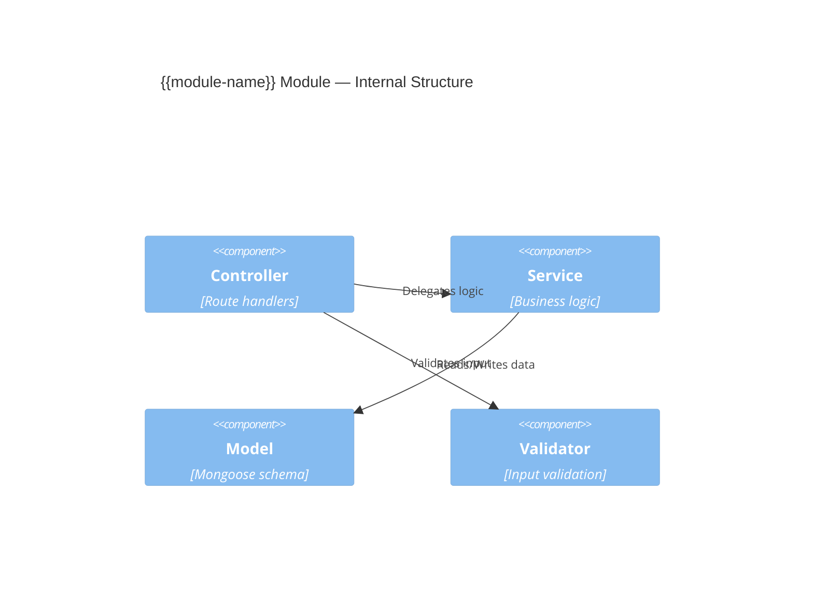

# Module — {{module-name}}

## Overview

> One-paragraph summary: what this module does and why it exists.

{{Describe the module's core responsibility in the system.}}

## Responsibility

| Aspect | Description |
|--------|-------------|
| **Core purpose** | {{what this module is responsible for}} |
| **Input** | {{what triggers or feeds this module}} |
| **Output** | {{what this module produces or affects}} |
| **Owns** | {{data/entities this module owns}} |

## Internal Structure

## Key Files

| File | Purpose |
|------|---------|
| `{{path}}/controller.ts` | {{description}} |
| `{{path}}/service.ts` | {{description}} |
| `{{path}}/model.ts` | {{description}} |
| `{{path}}/routes.ts` | {{description}} |

## Business Rules

1. {{Rule 1 — describe validation, constraint, or logic}}
2. {{Rule 2}}
3. {{Rule 3}}

## Dependencies

| Depends On | Why |
|------------|-----|
| [[Module - {{other-module}}]] | {{reason}} |

| Depended On By | Why |
|----------------|-----|
| [[Module - {{dependent}}]] | {{reason}} |

## Edge Cases & Known Issues

- {{Edge case 1}}
- {{Known issue 1}}

## Facts

> [!NOTE] Fact
> {{Verified module behaviour from code.}}

## Assumptions

> [!WARNING] Assumption
> {{Inferred behaviour or responsibility.}}

## Open Questions

> [!CAUTION] Open Question
> {{Unclear module behaviour.}}

## Related Notes

- [[05 Building Block View - {{system-name}}]]
- {{Link to related flows, APIs, entities}}
