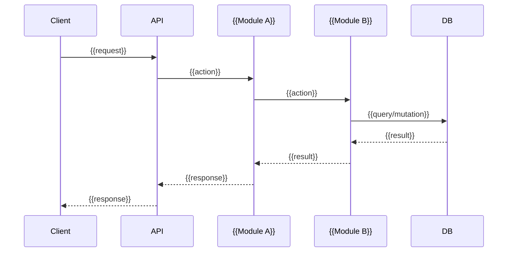
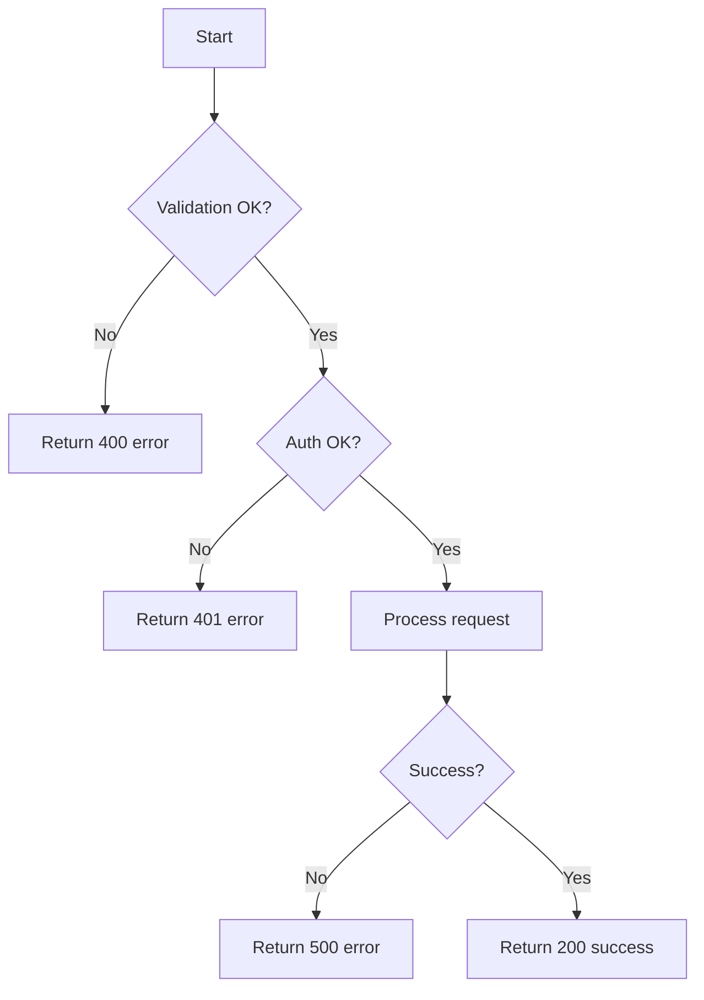

# Flow — {{flow-name}}

## Overview

> One-paragraph summary: what this flow does, who triggers it, and what the expected outcome is.

{{Describe the business flow.}}

## Trigger

| Attribute | Value |
|-----------|-------|
| **Initiator** | {{e.g. User action / Cron job / Webhook}} |
| **Entry point** | {{e.g. POST /api/v1/bookings}} |
| **Preconditions** | {{what must be true before this flow starts}} |

## Happy Path

## Error / Alternative Paths

| Scenario | Condition | Response | HTTP Code |
|----------|-----------|----------|-----------|
| Validation failure | {{condition}} | {{error message}} | 400 |
| Auth failure | {{condition}} | {{error message}} | 401 |
| Not found | {{condition}} | {{error message}} | 404 |
| Server error | {{condition}} | {{error message}} | 500 |

## Modules Involved

| Module | Role in This Flow |
|--------|-------------------|
| [[Module - {{module-a}}]] | {{what it does here}} |
| [[Module - {{module-b}}]] | {{what it does here}} |

## Side Effects

- {{e.g. Sends notification email}}
- {{e.g. Updates user balance}}
- {{e.g. Creates audit log entry}}

## Facts

> [!NOTE] Fact
> {{Verified flow behaviour from code.}}

## Assumptions

> [!WARNING] Assumption
> {{Inferred flow behaviour or ordering.}}

## Open Questions

> [!CAUTION] Open Question
> {{Unclear flow behaviour or edge cases.}}

## Related Notes

- [[06 Runtime View - {{system-name}}]]
- {{Link to related modules, APIs, entities}}
