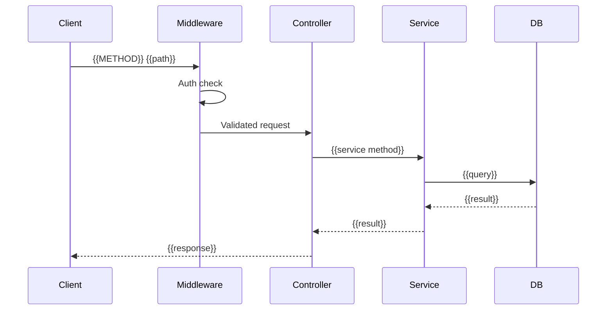

# API — {{api-name}}

## Overview

> What does this API group do? Who consumes it?

{{Describe the API group and its consumers.}}

## Endpoints

### `{{METHOD}} {{/api/path}}`

**Purpose**: {{what this endpoint does}}

**Authentication**: {{required / optional / none}}

**Request**:
```json
{
  "{{field}}": "{{type}} — {{description}}"
}
```

**Response** (`200`):
```json
{
  "success": true,
  "data": {
    "{{field}}": "{{type}} — {{description}}"
  }
}
```

**Error Responses**:

| Code | Condition | Body |
|------|-----------|------|
| 400 | {{validation error}} | `{ "error": "{{message}}" }` |
| 401 | {{auth failure}} | `{ "error": "Unauthorized" }` |
| 404 | {{not found}} | `{ "error": "Not found" }` |

### `{{METHOD}} {{/api/path/2}}`

{{Repeat the pattern above for each endpoint.}}

## Call Sequence



## Rate Limiting / Throttling

| Rule | Value | Notes |
|------|-------|-------|
| {{e.g. Max requests}} | {{e.g. 100/min}} | {{per user / per IP}} |

## Facts

> [!NOTE] Fact
> {{Verified API behaviour from code/swagger.}}

## Assumptions

> [!WARNING] Assumption
> {{Inferred API behaviour.}}

## Open Questions

> [!CAUTION] Open Question
> {{Unclear API behaviour or missing documentation.}}

## Related Notes

- [[Module - {{module-name}}]]
- {{Link to related flows and entities}}
