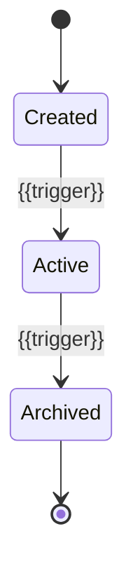

# Entity — {{entity-name}}

## Overview

> What does this entity represent? Which module owns it?

{{Describe the entity's role in the domain model.}}

## Schema

| Field | Type | Required | Default | Description |
|-------|------|----------|---------|-------------|
| `_id` | ObjectId | Yes | Auto | Primary key |
| `{{field}}` | {{String/Number/Date/Boolean/ObjectId}} | {{Yes/No}} | {{value}} | {{description}} |

## ER Diagram

```mermaid
erDiagram
    {{ENTITY-NAME}} {
        ObjectId _id PK
        String field1
        Number field2
        Date createdAt
        Date updatedAt
    }

    {{RELATED-ENTITY}} {
        ObjectId _id PK
        ObjectId entityId FK
    }

    {{ENTITY-NAME}} ||--o{ {{RELATED-ENTITY}} : "has many"
```

## Indexes

| Index | Fields | Type | Purpose |
|-------|--------|------|---------|
| {{name}} | {{fields}} | {{unique/compound/text}} | {{why}} |

## Validations

| Field | Rule | Error |
|-------|------|-------|
| `{{field}}` | {{e.g. required, min length 3}} | {{error message}} |

## Lifecycle



## Access Patterns

| Query | Module | Frequency | Notes |
|-------|--------|-----------|-------|
| {{query description}} | [[Module - {{module}}]] | {{high/medium/low}} | {{notes}} |

## Facts

> [!NOTE] Fact
> {{Verified schema from model code.}}

## Assumptions

> [!WARNING] Assumption
> {{Inferred entity behaviour.}}

## Open Questions

> [!CAUTION] Open Question
> {{Unclear entity relationships or constraints.}}

## Related Notes

- [[Module - {{module-name}}]]
- {{Link to related entities, flows, APIs}}
