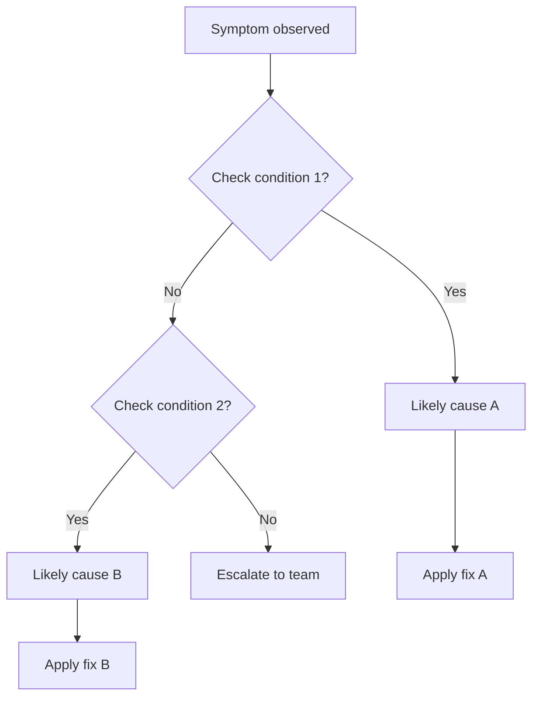

# Troubleshooting — {{topic}}

## Symptom

> What does the user or system observe when this issue occurs?

{{Describe the visible symptom.}}

## Root Cause

> What causes this issue?

{{Explain the underlying cause.}}

## Diagnosis Steps

1. {{Step 1 — what to check}}
2. {{Step 2 — what to check}}
3. {{Step 3 — what to look for}}

## Resolution

### Quick Fix
{{Immediate resolution steps.}}

### Permanent Fix
{{Long-term solution.}}

## Prevention

- {{How to prevent this from recurring}}

## Facts

> [!NOTE] Fact
> {{Verified cause and resolution from experience.}}

## Assumptions

> [!WARNING] Assumption
> {{Inferred root cause.}}

## Open Questions

> [!CAUTION] Open Question
> {{Unclear aspects of this issue.}}

## Related Notes

- [[Module - {{module-name}}]]
- {{Link to related flows or entities}}
